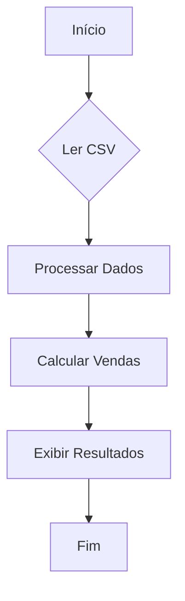

# Desafio: Análise de Vendas de Produtos

Objetivo: Dado um arquivo CSV contendo dados de vendas de produtos, o desafio consiste em ler os dados, processá-los em um dicionário para análise e, por fim, calcular e reportar as vendas totais por categoria de produto.

**Fluxo**:

**Tarefas**:

1. Ler o arquivo CSV e carregar os dados.
2. Processar os dados em um dicionário, onde a chave é a categoria, e o valor é uma lista de dicionários, cada um contendo informações do produto (`Produto`, `Quantidade`, `Venda`).
3. Calcular o total de vendas (`Quantidade` * `Venda`) por categoria.