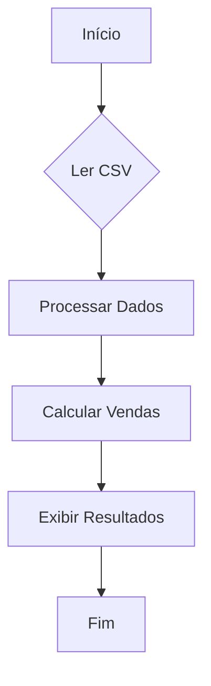

# Desafio: Análise de Vendas de Produtos

Objetivo: Dado um arquivo CSV contendo dados de vendas de produtos, o desafio consiste em ler os dados, processá-los em um dicionário para análise e, por fim, calcular e reportar as vendas totais por categoria de produto.

**Fluxo**:

**Tarefas**:

1. Ler o arquivo CSV e carregar os dados.
2. Processar os dados em um dicionário, onde filtra os produtos que foram entregues.
3. Calcular o valor total dos produtos entregues.